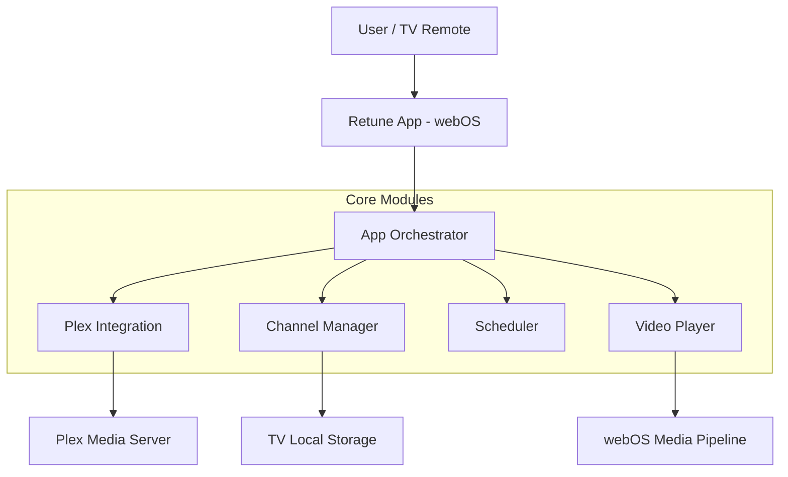

# Architecture Overview

Retune is a client-side web application built for LG webOS. It connects directly to the user's Plex Media Server.

## High-Level Architecture

Diagram Description (Accessibility)

The architecture diagram shows the user interacting with their TV remote, which sends input to the Retune App running on webOS. The App Orchestrator coordinates four core modules: Plex Integration (connects to Plex Media Server), Channel Manager (uses TV Local Storage), Scheduler, and Video Player (uses webOS Media Pipeline).

## Key Principles

1. **Direct Connection**: The app communicates directly with your Plex server. There is no intermediate "Retune cloud" server.
2. **Client-Side Logic**: All channel scheduling and state management happens locally on the TV.
3. **Deterministic Scheduling**: Channel schedules are generated algorithmically based on wall-clock time, ensuring that if you leave and come back, the "broadcast" continues seamlessly.
4. **Zero Transcode Goal**: The app prioritizes Direct Play to minimize server load and maximize quality.

## Data Flow

1. **Initialization**: App checks for valid Plex token in LocalStorage.
2. **Discovery**: App queries Plex.tv resources to find available servers.
3. **Channel Hydration**: App loads channel configs and requested content (metadata) from the selected Plex server.
4. **Scheduling**: `ScheduleCalculator` determines what item should be playing *right now* on the active channel.
5. **Playback**: `VideoPlayer` receives a stream URL from `PlexStreamResolver` and hands it to the webOS video element.

## Technology Stack

- **Platform**: LG webOS 6.0+
- **Language**: TypeScript / Node.js 18+
- **Framework**: Custom vanilla JS architecture (no heavy reactive framework like React/Vue) for maximum performance on TV hardware.
- **Build Tool**: Vite (likely, or custom webpack/rollup per project setup)
