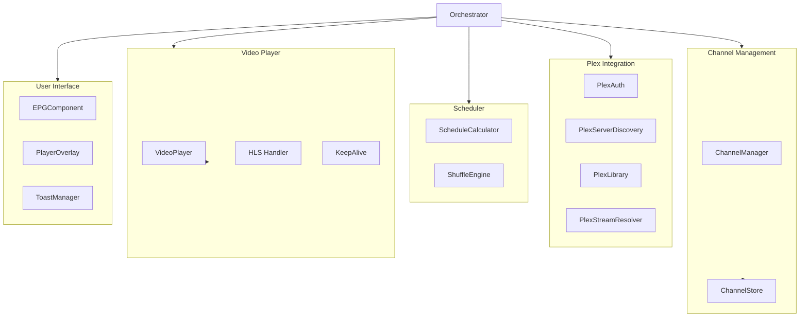

# Module Breakdown

The application is divided into several distinct modules to separate concerns.

Diagram Description (Accessibility)

The diagram shows the App Orchestrator at the center, connecting to five module groups: Plex Integration (PlexAuth, PlexServerDiscovery, PlexLibrary, PlexStreamResolver), Channel Management (ChannelManager, ChannelStore), Scheduler (ScheduleCalculator, ShuffleEngine), Video Player (VideoPlayer, HLS Handler, KeepAlive), and User Interface (EPGComponent, PlayerOverlay, ToastManager).

## 1. Plex Integration (`src/modules/plex/`)

Handles all communication with the Plex ecosystem.

- **PlexAuth**: Manages OAuth PIN flow and token storage.
- **PlexServerDiscovery**: Finds and tests connections to Plex servers.
- **PlexLibrary**: Fetches metadata for libraries, seasons, and episodes.
- **PlexStreamResolver**: Determines the best playback URL (Direct Play vs. Transcode).

## 2. Channel Management (`src/modules/channels/`)

Manages the virtual channel definitions.

- **ChannelManager**: CRUD operations for channels.
- **ChannelStore**: Persists channel configurations to LocalStorage.

## 3. Scheduler (`src/modules/scheduler/`)

The brain of the operation. Determines what plays when.

- **ScheduleCalculator**: Pure function that takes a list of media duration and a start time, and calculates the precise playback position for the current wall-clock time.
- **ShuffleEngine**: Deterministic pseudo-random number generator (PRNG) to ensure daily shuffle orders are consistent.

## 4. Video Player (`src/modules/player/`)

Wraps the native webOS video element.

- **VideoPlayer**: Handles play, pause, seek, and track selection.
- **HLS**: Manages HLS stream events (if using native HLS or hls.js fallback).
- **KeepAlive**: Prevents the TV from sleeping during playback.

## 5. UI (`src/modules/ui/`)

Manages the visual interface.

- **EPGComponent**: The grid view guides.
- **PlayerOverlay**: The on-screen controls during playback.
- **ToastManager**: Notifications.

## 6. App Orchestrator (`src/Orchestrator.ts`)

The central nervous system. It wires modules together, orchestrating event flows: User presses Channel Up → Scheduler selects next channel → Player loads the stream.
