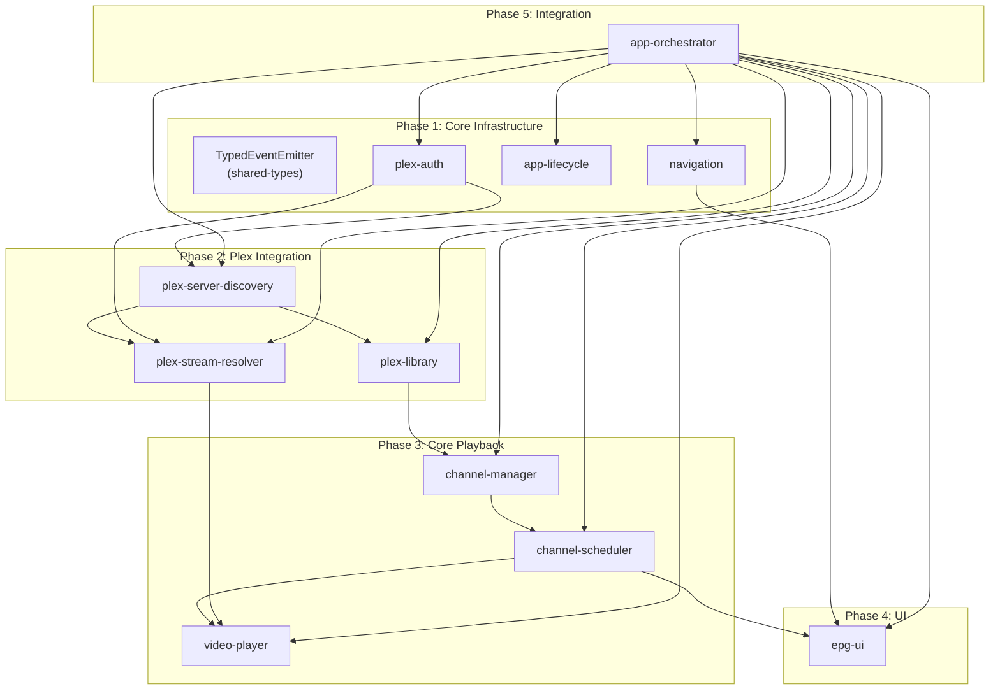

# Retune Implementation Spec Pack

**Version:** 1.0.0  
**Generated:** December 30, 2024  
**Platform:** LG webOS 4.0+ (Chromium 68)

---

## Overview

This spec pack contains everything needed to implement **Retune**, a webOS application that transforms Plex media libraries into virtual linear TV channels. The pack is structured for AI-assisted development, where each module can be implemented independently.

## What is Retune?

Retune creates a traditional TV experience from your Plex library:
- Browse an EPG (Electronic Program Guide) showing scheduled content
- Tune to virtual channels that play content at specific times
- Content plays at the "correct" position based on wall-clock time
- Switch channels like traditional television

## Target Platform

| Requirement | Value |
|------------|-------|
| Platform | LG webOS 4.0+ |
| Browser Engine | Chromium 68 |
| Resolution | 1920×1080 |
| Input | LG Magic Remote (D-pad + pointer) |
| Memory Target | < 300MB |

---

## Artifacts in This Pack

| # | Artifact | File | Purpose |
|---|----------|------|---------|
| 1 | Module Dependency Graph | `artifact-1-dependency-graph.json` | Module relationships and implementation order |
| 2 | Shared Types | `artifact-2-shared-types.ts` | All TypeScript types and interfaces |
| 3 | Module Specs | `modules/*.md` | Detailed specs for each module |
| 4 | Integration Contracts | `artifact-4-integration-contracts.md` | Inter-module communication patterns |
| 5 | Configuration | `artifact-5-config.ts` | All constants and configuration |
| 6 | File Manifest | `artifact-6-file-manifest.json` | Complete list of files to create |
| 7 | Implementation Prompts | `artifact-7-implementation-prompts.md` | Self-contained AI agent prompts |
| 8 | Verification Checklist | `artifact-8-verification-checklist.md` | Test and validation checklist |
| 9 | Plex API Examples | `artifact-9-plex-api-examples.md` | JSON response examples for Plex endpoints |

---

## Module Summary

```
┌─────────────────────────────────────────────────────────────────┐
│                      APP ORCHESTRATOR                           │
│              (coordinates all modules)                          │
└─────────────────────────────────────────────────────────────────┘
        │                    │                    │
        ▼                    ▼                    ▼
┌───────────────┐    ┌───────────────┐    ┌───────────────┐
│   LIFECYCLE   │    │  NAVIGATION   │    │   EPG UI      │
│ - State save  │    │ - Remote keys │    │ - Grid view   │
│ - Error recov │    │ - Focus mgmt  │    │ - Virtualized │
└───────────────┘    └───────────────┘    └───────────────┘
                             │                    │
        ┌────────────────────┼────────────────────┘
        │                    │
        ▼                    ▼
┌───────────────┐    ┌───────────────┐
│VIDEO PLAYER   │    │  SCHEDULER    │
│ - HLS native  │    │ - Deterministic│
│ - Subtitles   │    │ - O(log n)    │
└───────────────┘    └───────────────┘
        │                    │
        │                    ▼
        │            ┌───────────────┐
        │            │CHANNEL MANAGER│
        │            │ - Config CRUD │
        │            │ - Content res │
        │            └───────────────┘
        │                    │
        ▼                    ▼
┌─────────────────────────────────────────┐
│            PLEX INTEGRATION             │
│  ┌──────────┐ ┌──────────┐ ┌──────────┐ │
│  │   Auth   │ │ Library  │ │  Stream  │ │
│  │ (OAuth)  │ │ (Browse) │ │(Resolve) │ │
│  └──────────┘ └──────────┘ └──────────┘ │
└─────────────────────────────────────────┘
```

---

## Implementation Order

### Phase 1: Core Infrastructure (Days 1-3)
1. `event-emitter` - Typed pub/sub utility
2. `plex-auth` - Plex OAuth authentication
3. `app-lifecycle` - State persistence
4. `navigation` - Remote control handling

### Phase 2: Plex Integration (Days 4-7)
5. `plex-server-discovery` - Find Plex servers
6. `plex-library` - Browse media libraries
7. `plex-stream-resolver` - Resolve playback URLs

### Phase 3: Core Playback MVP (Days 8-12)
8. `video-player` - Media playback
9. `channel-manager` - Channel configuration
10. `channel-scheduler` - Schedule generation

### Phase 4: Full UI (Days 13-16)
11. `epg-ui` - Program guide grid

### Phase 5: Integration (Days 17-19)
12. `app-orchestrator` - Wire everything together

---

## Quick Start for AI Agents

### Implementing a Single Module

1. Read the module spec in `modules/{module-name}.md`
2. Reference types in `artifact-2-shared-types.ts`
3. Check integration contracts in `artifact-4-integration-contracts.md`
4. Use constants from `artifact-5-config.ts`
5. Follow the implementation prompt in `artifact-7-implementation-prompts.md`

### Key Constraints

| Constraint | Details |
|------------|---------|
| No Math.random() | Use Mulberry32 PRNG with seed for determinism |
| No HLS.js | webOS has native HLS support |
| No ES2020+ features | Target Chromium 68 |
| Max 300MB memory | Virtualize large lists |
| 60fps minimum | No blocking operations |

### Performance Budgets

| Operation | Target | Maximum | Measurement |
|-----------|--------|---------|------------|
| App cold start | <3s | 5s | Time to first playable frame |
| EPG render (5ch × 3hr) | <100ms | 200ms | requestAnimationFrame delta |
| Channel switch | <500ms | 1000ms | Time to first video frame |
| Schedule lookup | <5ms | 10ms | `getProgramAtTime()` call |
| Memory usage | <200MB | 300MB | `performance.memory.usedJSHeapSize` |
| Frame rate | 60fps | >30fps | DevTools Performance tab |
| Bundle size | <500KB | 1MB | gzip compressed |
| localStorage | <2MB | 5MB | Channel configs + state |

### Module Dependency Diagram



### Module Priority Clarification

| Priority | Module | Blocking? | Reason |
|----------|--------|-----------|--------|
| 1 | plex-auth | Yes | All Plex operations require authentication |
| 1 | app-lifecycle | Yes | State persistence needed for recovery |
| 1 | navigation | Yes | User input is fundamental |
| 2 | plex-server-discovery | Yes | Must connect before library access |
| 3 | plex-library | Yes | Content resolution depends on this |
| 3 | plex-stream-resolver | Yes | Playback requires stream URLs |
| 4 | channel-manager | Yes | Scheduler needs channel configs |
| 5 | channel-scheduler | Yes | Playback timing depends on this |
| 5 | video-player | Yes | Core playback functionality |
| 6 | epg-ui | No | MVP can work without guide |
| 7 | app-orchestrator | No | Integration layer, implements last |

---

## Architecture Decisions

### Why Deterministic Scheduling?
Multiple devices must show the same "channel" at the same time. Given the same content, seed, and anchor time, all calculations produce identical results.

### Why Virtualized Rendering?
EPG could have 50 channels × 48 half-hours = 2400 cells. Rendering all would kill performance. We render only visible cells (~200 max).

### Why No Third-Party HLS Library?
HLS.js and similar cause memory bloat on webOS. The built-in HLS support is more stable for long-running playback.

### Why Module Pattern?
Clear boundaries enable parallel AI-assisted development. Each module has explicit interfaces and can be tested independently.

---

## File Locations

```
spec-pack/
├── README.md                              # This file
├── artifact-1-dependency-graph.json       # Module dependencies
├── artifact-2-shared-types.ts             # All TypeScript types
├── artifact-4-integration-contracts.md    # Module communication
├── artifact-5-config.ts                   # Constants and config
├── artifact-6-file-manifest.json          # File manifest
├── artifact-7-implementation-prompts.md   # AI agent prompts
├── artifact-8-verification-checklist.md   # Test checklist
└── modules/
    ├── plex-auth.md                       # Plex authentication
    ├── channel-scheduler.md               # Schedule generation
    ├── video-player.md                    # Media playback
    ├── epg-ui.md                          # Program guide UI
    └── navigation.md                      # Remote + focus
```

---

## Validation

After implementation, run through `artifact-8-verification-checklist.md`:
- Phase 1: Build verification (TypeScript, bundle, package)
- Phase 2: Module unit tests
- Phase 3: Integration tests
- Phase 4: Performance tests
- Phase 5: webOS platform tests
- Phase 6: Stress tests
- Phase 7: User experience tests

---

## Quick Reference

### Key Formulas

**Schedule Position:**
```typescript
position = (currentTime - anchorTime) % totalLoopDuration
```

**Program Lookup (O(log n)):**
```typescript
itemIndex = binarySearch(itemStartOffsets, position)
```

**Deterministic Shuffle Seed:**
```typescript
seed = hash(channelId + anchorTime)
```

### Key Storage Keys
| Key | Purpose |
|-----|---------|
| `retune_plex_auth` | Plex credentials |
| `retune_channels` | Channel configurations |
| `retune_preferences` | User preferences |
| `retune_app_state` | App state (last channel, etc.) |

### Key Events
| Event | Emitter | Purpose |
|-------|---------|---------|
| `programStart` | Scheduler | New program begins |
| `programEnd` | Scheduler | Current program ends |
| `channelSelected` | EPG | User selected from guide |
| `keyPress` | Navigation | Remote button pressed |
| `stateChange` | VideoPlayer | Playback state changed |

---

## Support

This spec pack was generated from `initial_plan.md`. For questions about architectural decisions, refer to the original planning document.
