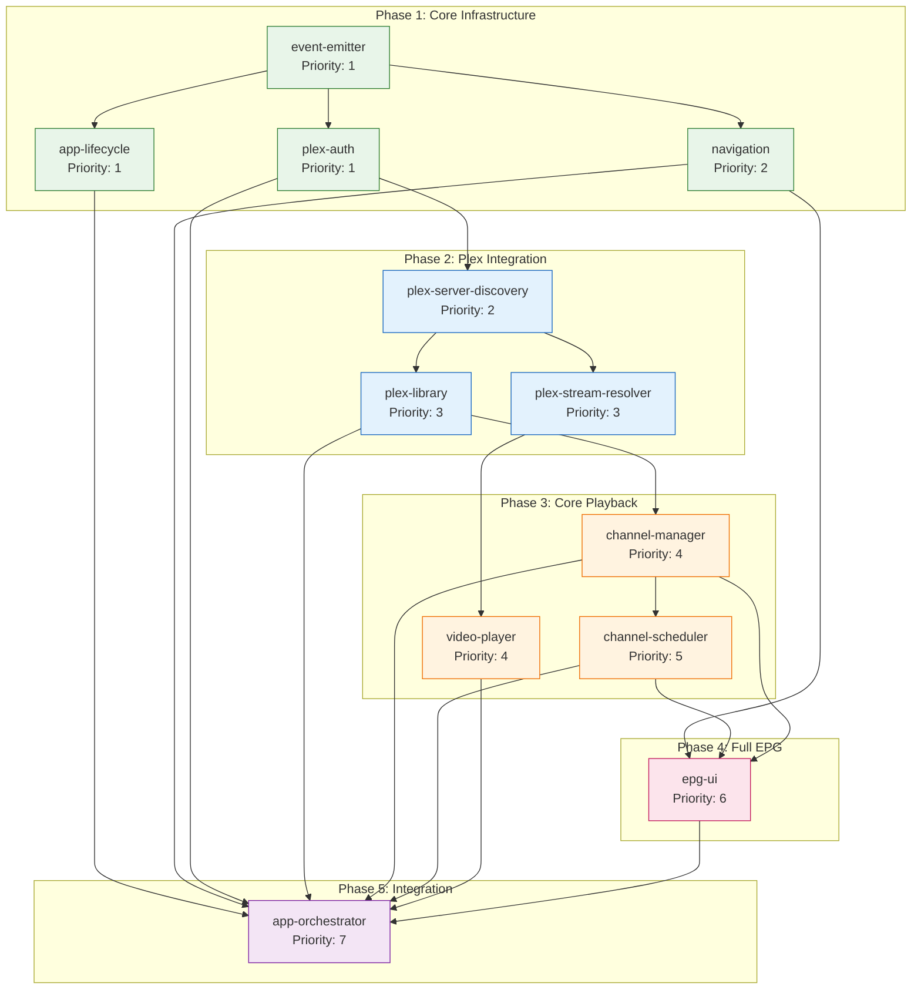
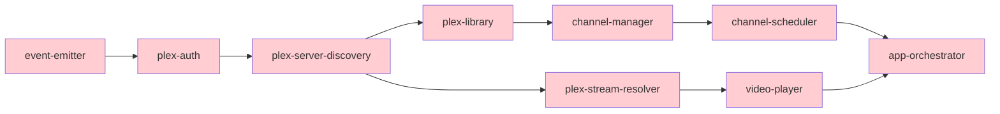
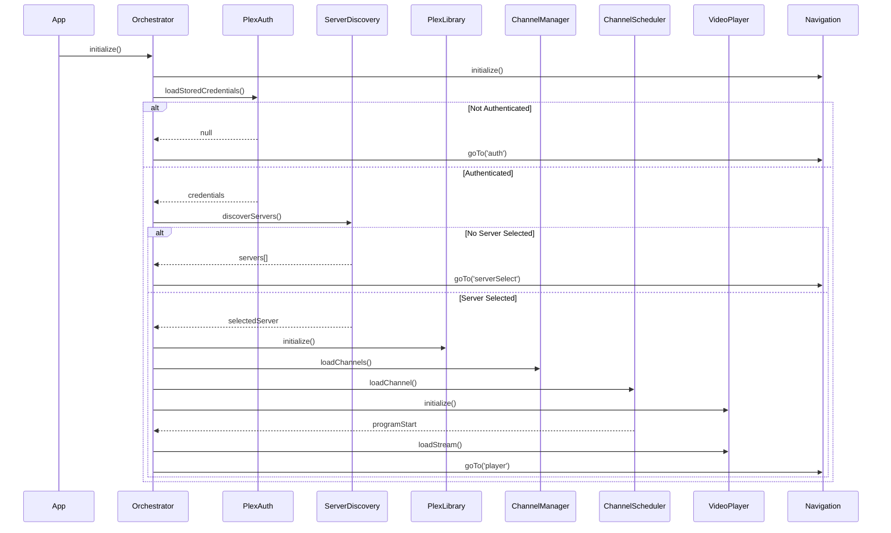
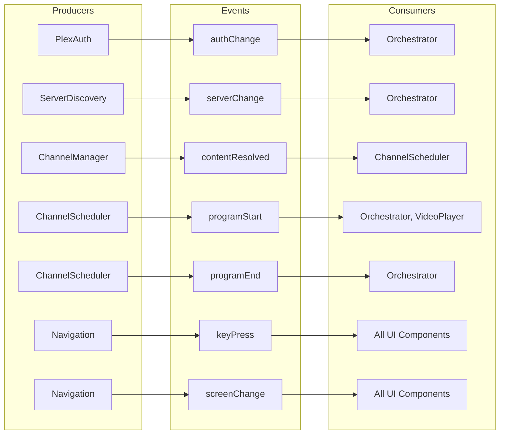

# Module Dependency Graph

Visual representation of module dependencies in the Retune application.

## Implementation Order Diagram

## Critical Path

## Module Matrix

| Module | Depends On | Provides | Consumes |
| :--- | :--- | :--- | :--- |
| event-emitter | - | TypedEventEmitter | - |
| plex-auth | event-emitter | IPlexAuth, PlexAuthToken | - |
| app-lifecycle | event-emitter | IAppLifecycle | - |
| navigation | event-emitter | INavigationManager | keyPress events |
| plex-server-discovery | plex-auth | IPlexServerDiscovery | authChange |
| plex-library | plex-auth, discovery | IPlexLibrary | authChange |
| plex-stream-resolver | plex-auth, discovery | IPlexStreamResolver | authChange |
| channel-manager | plex-library | IChannelManager | - |
| channel-scheduler | channel-manager | IChannelScheduler | contentResolved |
| video-player | plex-stream-resolver | IVideoPlayer | - |
| epg-ui | navigation, scheduler, manager | IEPGComponent | scheduleSync, channelUpdated |
| app-orchestrator | ALL | IOrchestrator | ALL events |

## Startup Initialization Sequence

## Event Flow

