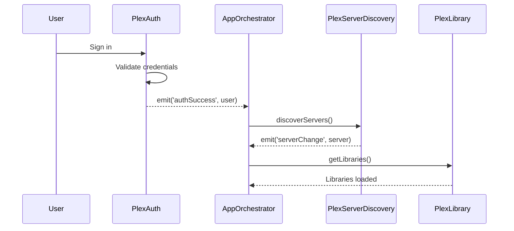
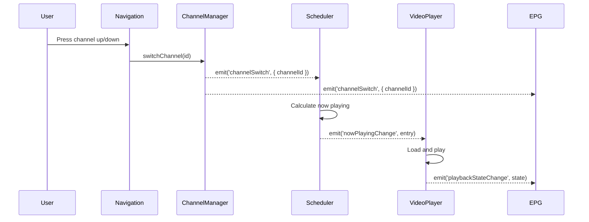
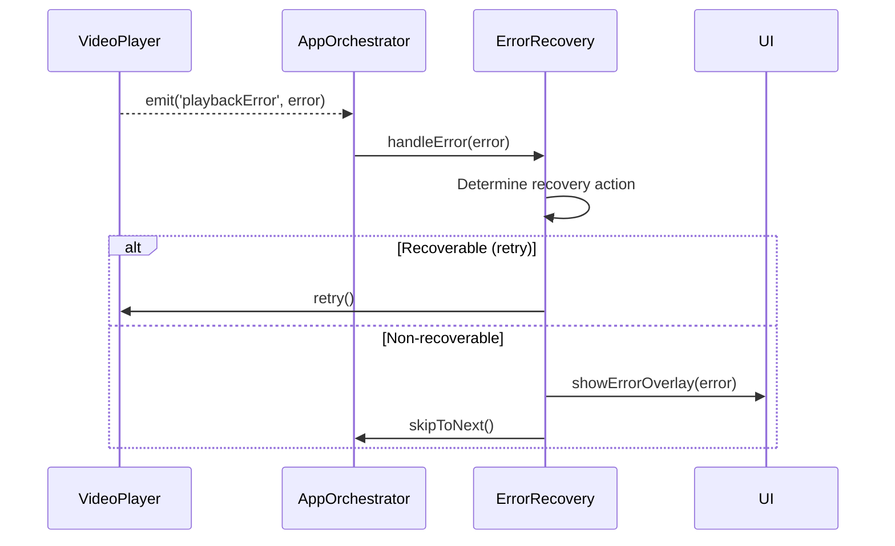

# Artifact 17: Event Flow Map

> **Document Type**: Supplemental Reference
> **Purpose**: Single source of truth for all event flows across modules

## Overview

This artifact maps all events in the Retune architecture, documenting:

- Event name and payload type
- Emitting module(s)
- Consuming module(s)
- Handler behavior and spec location

## Event Registry

| Event Name | Payload Type | Emitter(s) | Consumer(s) | Handler Behavior | Spec Location |
|------------|--------------|------------|-------------|------------------|---------------|
| `authStateChange` | `AuthState` | plex-auth | app-orchestrator, channel-manager | Clear cached tokens, redirect to auth | [plex-auth.md#events-emitted](modules/plex-auth.md) |
| `authExpired` | `void` | plex-auth, plex-library | app-orchestrator | Show auth screen | [plex-auth.md#events-emitted](modules/plex-auth.md) |
| `authSuccess` | `PlexUser` | plex-auth | app-orchestrator | Trigger server discovery | [plex-auth.md#events-emitted](modules/plex-auth.md) |
| `serverChange` | `PlexServer` | plex-server-discovery | plex-library, plex-stream-resolver | Update server URI | [plex-server-discovery.md#events-emitted](modules/plex-server-discovery.md) |
| `connectionChange` | `ServerConnection` | plex-server-discovery | plex-stream-resolver | Update connection info | [plex-server-discovery.md#events-emitted](modules/plex-server-discovery.md) |
| `libraryRefreshed` | `{ libraryId: string }` | plex-library | channel-manager | Refresh channel content | [plex-library.md#events-emitted](modules/plex-library.md) |
| `channelChange` | `Channel` | channel-manager | channel-scheduler, epg-ui | Update schedule | [channel-manager.md#events-emitted](modules/channel-manager.md) |
| `channelSwitch` | `{ channelId: string }` | channel-manager | channel-scheduler, video-player | Switch playback | [channel-manager.md#events-emitted](modules/channel-manager.md) |
| `scheduleUpdate` | `ScheduleEntry[]` | channel-scheduler | epg-ui, video-player | Update EPG display | [channel-scheduler.md#events-emitted](modules/channel-scheduler.md) |
| `nowPlayingChange` | `NowPlayingEntry` | channel-scheduler | video-player, epg-ui | Start playback | [channel-scheduler.md#events-emitted](modules/channel-scheduler.md) |
| `playbackStateChange` | `PlaybackState` | video-player | app-orchestrator, epg-ui | Update UI state | [video-player.md#events-emitted](modules/video-player.md) |
| `playbackError` | `AppError` | video-player | app-orchestrator | Handle error/skip | [video-player.md#events-emitted](modules/video-player.md) |
| `playbackComplete` | `{ itemKey: string }` | video-player | channel-scheduler | Advance schedule | [video-player.md#events-emitted](modules/video-player.md) |
| `sessionStart` | `{ sessionId: string; itemKey: string }` | plex-stream-resolver | app-orchestrator | Track session | [plex-stream-resolver.md#events-emitted](modules/plex-stream-resolver.md) |
| `sessionEnd` | `{ sessionId: string; itemKey: string; positionMs: number }` | plex-stream-resolver | app-orchestrator | Cleanup session | [plex-stream-resolver.md#events-emitted](modules/plex-stream-resolver.md) |
| `navigationChange` | `{ from: string; to: string }` | navigation | app-orchestrator | Handle focus | [navigation.md#events-emitted](modules/navigation.md) |
| `visibility` | `'visible' \| 'hidden'` | app-lifecycle | app-orchestrator, video-player | Pause/resume | [app-lifecycle.md#events-emitted](modules/app-lifecycle.md) |
| `networkStatus` | `'online' \| 'offline'` | app-lifecycle | app-orchestrator | Update connectivity state | [app-lifecycle.md#events-emitted](modules/app-lifecycle.md) |
| `memoryPressure` | `MemoryPressureLevel` | app-lifecycle | app-orchestrator | Clear caches | [app-lifecycle.md#events-emitted](modules/app-lifecycle.md) |
| `error` | `AppError` | (multiple modules) | app-orchestrator | Error recovery | [artifact-4-integration-contracts.md](#error-propagation-matrix) |

## Event Flow Diagrams

### Authentication Flow



### Channel Switch Flow



### Error Recovery Flow



## Event Bus Implementation

All events flow through the central EventEmitter utility. See [event-emitter.md](modules/event-emitter.md) for implementation details.

```typescript
// Event type definitions in artifact-2-shared-types.ts
export interface GlobalEventMap {
  authStateChange: AuthState;
  authExpired: void;
  authSuccess: PlexUser;
  serverChange: PlexServer;
  connectionChange: ServerConnection;
  libraryRefreshed: { libraryId: string };
  channelChange: Channel;
  channelSwitch: { channelId: string };
  scheduleUpdate: ScheduleEntry[];
  nowPlayingChange: NowPlayingEntry;
  playbackStateChange: PlaybackState;
  playbackError: AppError;
  playbackComplete: { itemKey: string };
  navigationChange: { from: string; to: string };
  visibility: 'visible' | 'hidden';
  networkStatus: 'online' | 'offline';
  memoryPressure: MemoryPressureLevel;
  error: AppError;
}
```

## Cross-Reference Index

This section provides quick lookup by module.

### Events Emitted by Module

| Module | Events |
|--------|--------|
| plex-auth | `authStateChange`, `authExpired`, `authSuccess` |
| plex-server-discovery | `serverChange`, `connectionChange` |
| plex-library | `authExpired`, `libraryRefreshed` |
| plex-stream-resolver | `sessionStart`, `sessionEnd`, `error` |
| channel-manager | `channelChange`, `channelSwitch` |
| channel-scheduler | `scheduleUpdate`, `nowPlayingChange` |
| video-player | `playbackStateChange`, `playbackError`, `playbackComplete` |
| navigation | `navigationChange` |
| app-lifecycle | `visibility`, `networkStatus`, `memoryPressure` |

### Events Consumed by Module

| Module | Events Listened |
|--------|-----------------|
| app-orchestrator | All events (central coordinator) |
| channel-manager | `serverChange`, `libraryRefreshed` |
| channel-scheduler | `channelChange`, `channelSwitch`, `playbackComplete` |
| video-player | `nowPlayingChange`, `visibility` |
| epg-ui | `scheduleUpdate`, `channelSwitch`, `playbackStateChange` |
| plex-library | `serverChange` |
| plex-stream-resolver | `serverChange`, `connectionChange` |

---

**Version**: 1.0  
**Created**: Per SUGGEST-004 remediation
