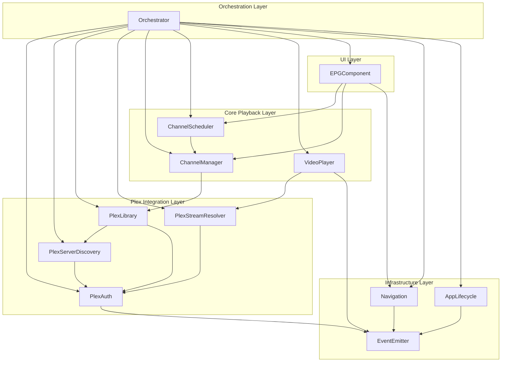
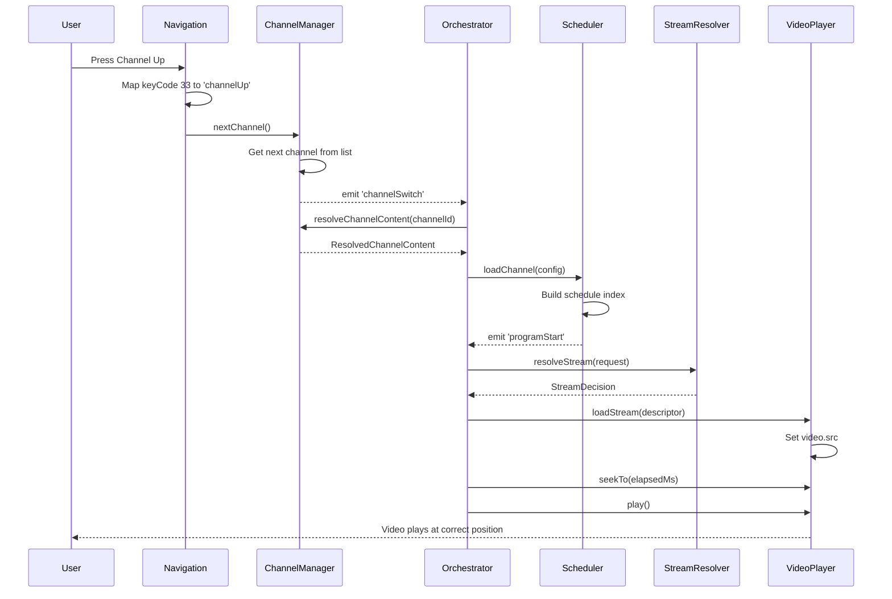
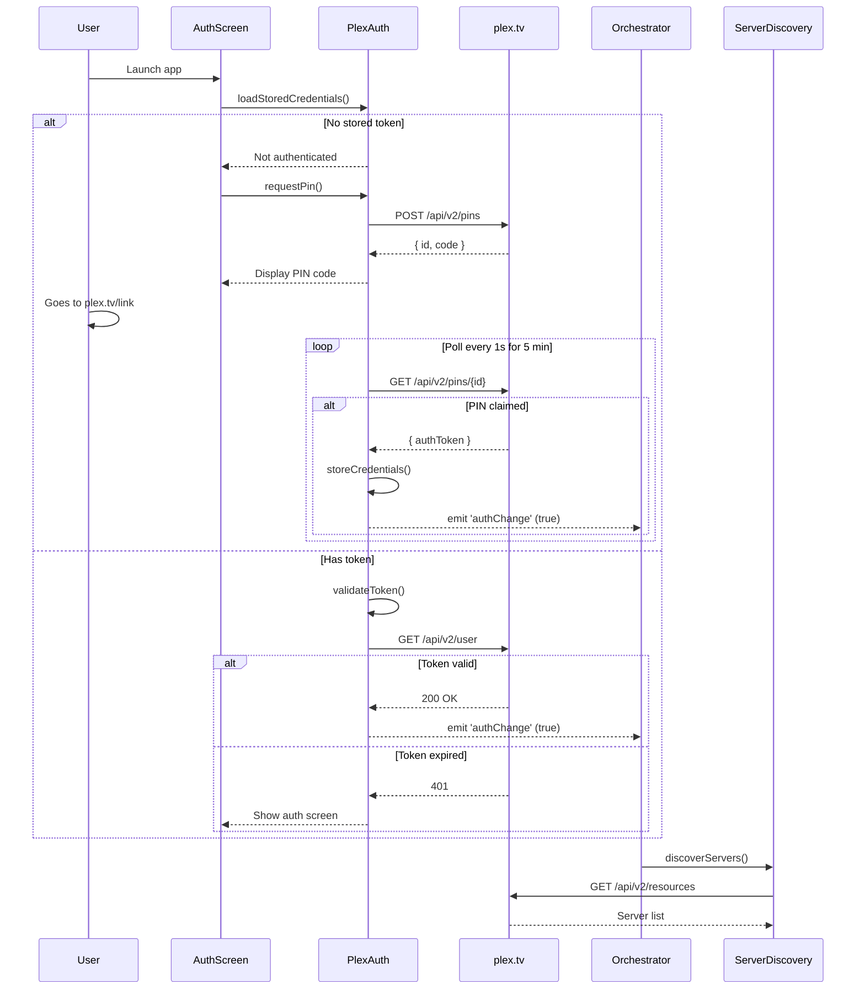
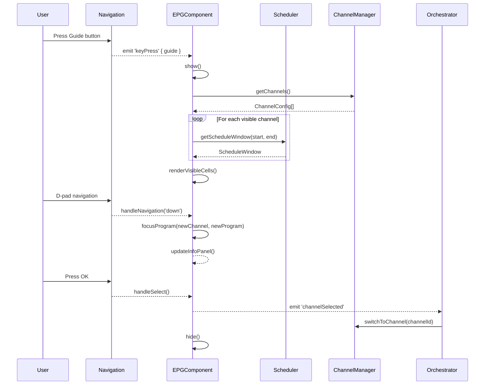
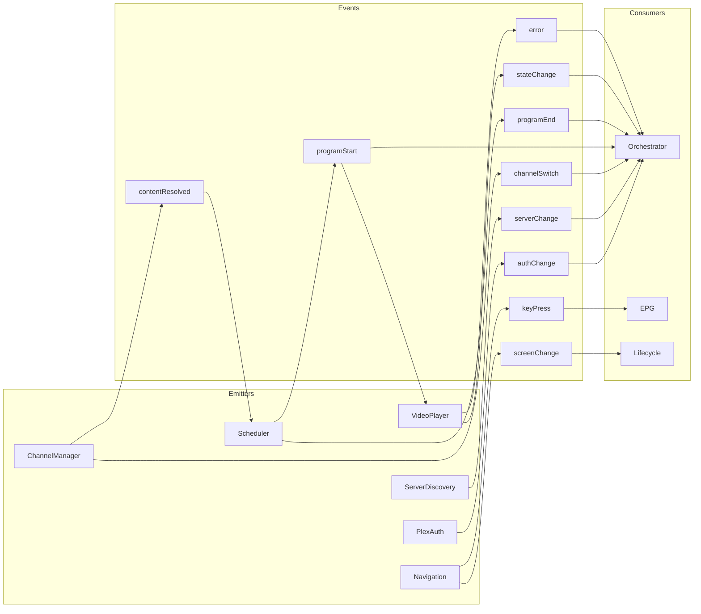
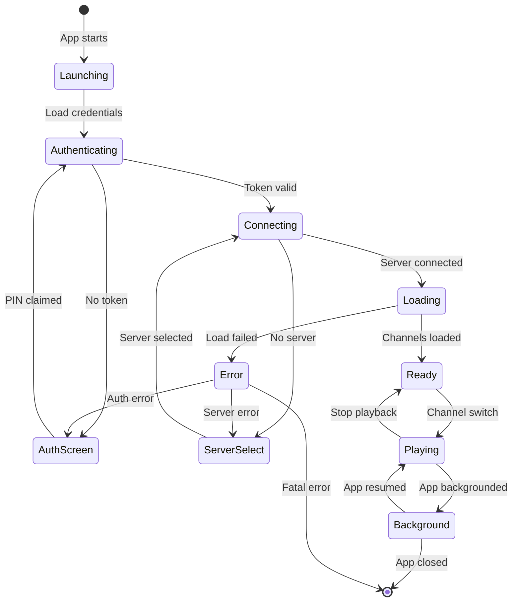

# Module Interaction Architecture

## Overview

This document visualizes the data flow and communication patterns between Retune modules.

---

## High-Level Module Dependency Graph

---

## Data Flow: Channel Switch Sequence

---

## Data Flow: Authentication

---

## Data Flow: EPG Interaction

---

## Event Bus Architecture

---

## Module State Diagram

---

## Module Interface Summary

| Module | Provides | Consumes | Key Events |
|--------|----------|----------|------------|
| EventEmitter | Event subscription | - | - |
| PlexAuth | Auth headers, token | - | `authChange` |
| ServerDiscovery | Server URI | PlexAuth | `serverChange` |
| PlexLibrary | Media metadata | PlexAuth, Discovery | `libraryRefreshed` |
| StreamResolver | Stream URLs | PlexAuth | - |
| ChannelManager | Channel configs | PlexLibrary | `channelSwitch`, `contentResolved` |
| ChannelScheduler | Program at time | ChannelManager | `programStart`, `programEnd` |
| VideoPlayer | Playback control | StreamResolver | `stateChange`, `error` |
| Navigation | Focus, keys | - | `keyPress`, `screenChange` |
| EPGComponent | Guide UI | Scheduler, Manager, Nav | `channelSelected` |
| AppLifecycle | Lifecycle hooks | - | `stateChange` |
| Orchestrator | Coordination | All above | - |
