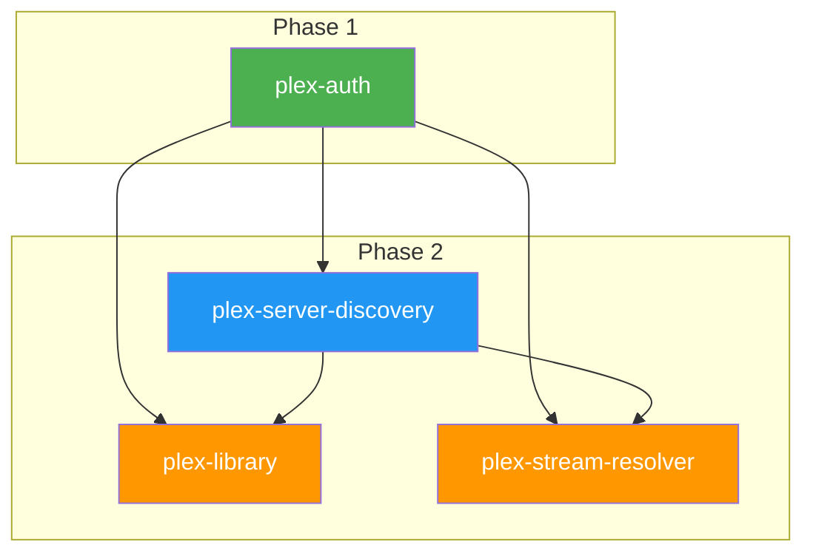

# Operational Plan: Phase 2 — Plex Integration

## Overview

| Metric | Value |
| :--- | :---: |
| **Phase** | 2 |
| **Name** | Plex Integration |
| **Modules** | 3 |
| **Parallelizable** | 2 (after plex-server-discovery) |
| **Sequential** | 1 (plex-server-discovery first) |
| **Estimated Days** | 4 |

---

## Pre-requisites

> [!IMPORTANT]
> Phase 2 cannot begin until Phase 1 is complete.

| Phase 1 Module | Required Status | Description |
| :--- | :---: | :--- |
| event-emitter | `complete` | Foundation event system |
| plex-auth | `complete` | Authentication tokens for API calls |
| app-lifecycle | `complete` | App state management |
| navigation | `complete` | Remote control handling |

**Gate Check Command:**

```bash
jq '.modules | to_entries[] | select(.key | test("event-emitter|plex-auth|app-lifecycle|navigation")) | "\(.key): \(.value.status)"' spec-pack/artifact-10-implementation-state.json
```

---

## Execution Sequence

### 1. Plex Server Discovery (First)

| Field | Value |
| :--- | :--- |
| **Module ID** | `plex-server-discovery` |
| **Spec** | `spec-pack/modules/plex-server-discovery.md` |
| **Context Handoff** | `spec-pack/context-handoff/plex-server-discovery.md` |
| **Implementation Prompt** | `artifact-7-implementation-prompts.md#prompt-8-v2` |
| **Dependencies** | `plex-auth` |
| **Estimated Complexity** | Medium |
| **Estimated LoC** | ~280 |

**Why First**: Only Phase 2 module with single dependency. Both plex-library and plex-stream-resolver need this.

**Key Implementation Points:**

- Fetch servers from `https://plex.tv/api/v2/resources`
- Connection priority: Local HTTPS > Local HTTP > Remote > Relay
- Handle mixed content (HTTP/HTTPS) restrictions
- Persist selected server to localStorage

---

### 2. Plex Library (After plex-server-discovery)

| Field | Value |
| :--- | :--- |
| **Module ID** | `plex-library` |
| **Spec** | `spec-pack/modules/plex-library.md` |
| **Context Handoff** | `spec-pack/context-handoff/plex-library.md` |
| **Implementation Prompt** | `artifact-7-implementation-prompts.md#prompt-9-v2` |
| **Dependencies** | `plex-auth`, `plex-server-discovery` |
| **Estimated Complexity** | High |
| **Estimated LoC** | ~500 |

**Parallelizable With**: `plex-stream-resolver`

**Key Implementation Points:**

- Paginated content retrieval (default 100 items/page)
- TV show hierarchy: Shows → Seasons → Episodes
- Image URL generation with auth token
- Collections and playlist support
- Memory budget: ~3MB total

---

### 3. Plex Stream Resolver (After plex-server-discovery)

| Field | Value |
| :--- | :--- |
| **Module ID** | `plex-stream-resolver` |
| **Spec** | `spec-pack/modules/plex-stream-resolver.md` |
| **Context Handoff** | `spec-pack/context-handoff/plex-stream-resolver.md` |
| **Implementation Prompt** | `artifact-7-implementation-prompts.md#prompt-10-v2` |
| **Dependencies** | `plex-auth`, `plex-server-discovery` |
| **Estimated Complexity** | Medium |
| **Estimated LoC** | ~320 |

**Parallelizable With**: `plex-library`

**Key Implementation Points:**

- Direct play detection (webOS codec support table is authoritative)
- HLS transcode URL generation
- Playback session management (required for "Continue Watching")
- Mixed content fallback strategy
- Progress reporting to Plex server

---

## Dependency Graph (Phase 2)



---

## Execution Strategy

### Recommended Approach

1. **Sequential**: Implement `plex-server-discovery` first and verify
2. **Parallel**: Once complete, implement `plex-library` and `plex-stream-resolver` in parallel

### Alternative (Single-Threaded)

If parallel execution is not available:

```text
1. plex-server-discovery → verify
2. plex-library          → verify  
3. plex-stream-resolver  → verify
```

---

## Phase Completion Criteria

- [ ] All 3 modules marked `complete` in `implementation-state.json`
- [ ] All verification commands pass:

  ```bash
  npx tsc --noEmit
  npm run lint
  npm test -- --testPathPattern="PlexServerDiscovery|PlexLibrary|PlexStreamResolver"
  ```

- [ ] Phase milestone achieved: *"Full Plex API integration complete. App can discover servers, browse libraries, and resolve playback URLs."*

---

## Orchestration Documents

| Module | Orchestration Doc |
| :--- | :--- |
| plex-server-discovery | `orchestration-docs/session-plex-server-discovery-1.md` |
| plex-library | `orchestration-docs/session-plex-library-1.md` |
| plex-stream-resolver | `orchestration-docs/session-plex-stream-resolver-1.md` |

---

## Risk Assessment

| Risk | Likelihood | Impact | Mitigation |
| :--- | :---: | :---: | :--- |
| Mixed content blocking on webOS | High | High | Use provided fallback strategy (HTTPS → relay) |
| Plex API rate limiting | Low | Medium | Respect ~100 req/min, exponential backoff |
| Large library pagination | Medium | Medium | Stream pages, don't load all into memory |
| Codec detection edge cases | Medium | Low | Use authoritative codec table from spec |

---

## API Endpoints Summary

| Module | Key Endpoints |
| :--- | :--- |
| plex-server-discovery | `GET plex.tv/api/v2/resources`, `GET {server}/identity` |
| plex-library | `GET /library/sections`, `GET /library/sections/{id}/all`, `GET /library/metadata/{key}/children` |
| plex-stream-resolver | `GET /library/parts/{id}/file.{ext}`, `GET /video/:/transcode/universal/start.m3u8`, `POST /:/timeline` |

---

*Generated by Planning Agent*  
*Timestamp: 2026-01-04T14:58:00-05:00*
