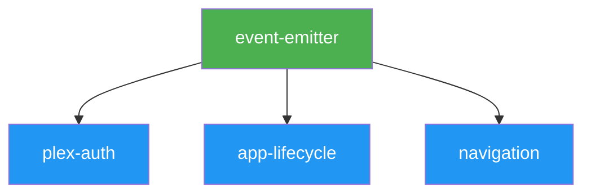

# Operational Plan: Phase 1 — Core Infrastructure

## Overview

| Metric | Value |
| :--- | :---: |
| **Phase** | 1 |
| **Name** | Core Infrastructure |
| **Modules** | 4 |
| **Parallelizable** | 3 (after event-emitter) |
| **Sequential** | 1 (event-emitter first) |
| **Estimated Days** | 3 |

---

## Execution Sequence

### 1. Event Emitter (First)

| Field | Value |
| :--- | :--- |
| **Module ID** | `event-emitter` |
| **Spec** | `spec-pack/modules/event-emitter.md` |
| **Context Handoff** | `spec-pack/context-handoff/event-emitter.md` |
| **Implementation Prompt** | `artifact-7-implementation-prompts.md#prompt-1` |
| **Dependencies** | None |
| **Estimated Complexity** | Low |
| **Estimated LoC** | ~80 |

**Why First**: Foundation module with zero dependencies. All other Phase 1 modules depend on this.

---

### 2. Plex Authentication (After event-emitter)

| Field | Value |
| :--- | :--- |
| **Module ID** | `plex-auth` |
| **Spec** | `spec-pack/modules/plex-auth.md` |
| **Context Handoff** | `spec-pack/context-handoff/plex-auth.md` |
| **Implementation Prompt** | `artifact-7-implementation-prompts.md#prompt-2` |
| **Dependencies** | `event-emitter` |
| **Estimated Complexity** | Medium |
| **Estimated LoC** | ~350 |

**Parallelizable With**: `app-lifecycle`, `navigation` (all share same dependency)

---

### 3. App Lifecycle (After event-emitter)

| Field | Value |
| :--- | :--- |
| **Module ID** | `app-lifecycle` |
| **Spec** | `spec-pack/modules/app-lifecycle.md` |
| **Context Handoff** | `spec-pack/context-handoff/app-lifecycle.md` |
| **Implementation Prompt** | `artifact-7-implementation-prompts.md#prompt-12` |
| **Dependencies** | `event-emitter` |
| **Estimated Complexity** | Medium |
| **Estimated LoC** | ~400 |

**Parallelizable With**: `plex-auth`, `navigation`

---

### 4. Navigation (After event-emitter)

| Field | Value |
| :--- | :--- |
| **Module ID** | `navigation` |
| **Spec** | `spec-pack/modules/navigation.md` |
| **Context Handoff** | `spec-pack/context-handoff/navigation.md` |
| **Implementation Prompt** | `artifact-7-implementation-prompts.md#prompt-5` |
| **Dependencies** | `event-emitter` |
| **Estimated Complexity** | High |
| **Estimated LoC** | ~520 |

**Parallelizable With**: `plex-auth`, `app-lifecycle`

---

## Dependency Graph (Phase 1)



---

## Execution Strategy

### Recommended Approach

1. **Sequential**: Implement `event-emitter` first and verify
2. **Parallel**: Once complete, implement `plex-auth`, `app-lifecycle`, and `navigation` in parallel

### Alternative (Single-Threaded)

If parallel execution is not available:

```text
1. event-emitter  → verify
2. plex-auth      → verify
3. app-lifecycle  → verify
4. navigation     → verify
```

---

## Phase Completion Criteria

- [ ] All 4 modules marked `complete` in `implementation-state.json`
- [ ] All verification commands pass:

  ```bash
  npx tsc --noEmit
  npm run lint
  npm test -- --testPathPattern="EventEmitter|PlexAuth|AppLifecycle|Navigation"
  ```

- [ ] Phase milestone achieved: *"Basic app shell with authentication flow and remote control handling. User can sign in with Plex and app responds to remote input."*

---

## Orchestration Documents

| Module | Orchestration Doc |
| :--- | :--- |
| event-emitter | `orchestration-docs/session-event-emitter-1.md` |
| plex-auth | `orchestration-docs/session-plex-auth-1.md` |
| app-lifecycle | `orchestration-docs/session-app-lifecycle-1.md` |
| navigation | `orchestration-docs/session-navigation-1.md` |

---

## Risk Assessment

| Risk | Likelihood | Impact | Mitigation |
| :--- | :---: | :---: | :--- |
| Network mocking complexity in plex-auth | Medium | Medium | Use provided mock patterns |
| webOS key codes in navigation | Low | Low | Key mapping table provided |
| localStorage mocking | Low | Low | Standard Jest mocking |

---

*Generated by Planning Agent*  
*Timestamp: 2026-01-04T14:36:00-05:00*
